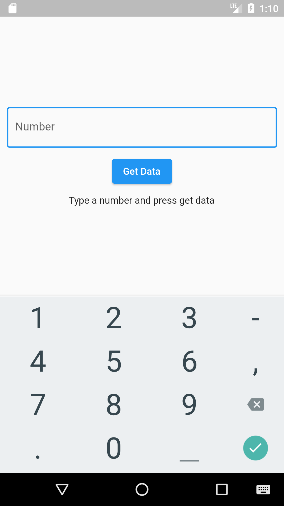
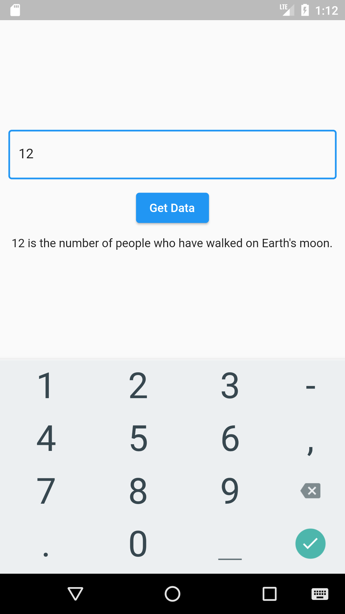
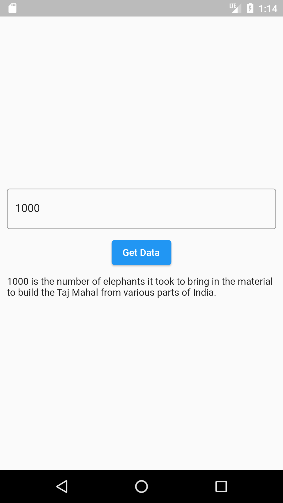

# http_sample
[Pub.dev - for adding packages](https://pub.dev/)
 
[Numbers API- for adding Number API](http://numbersapi.com/#42)

## used dependencies in this project
-  http: 0.13.4
-  json_annotation: 4.5.0
-  json_serializable: 6.2.0
-  build_runner
 
 "# http_sample"  
 
 
## Getting Started

